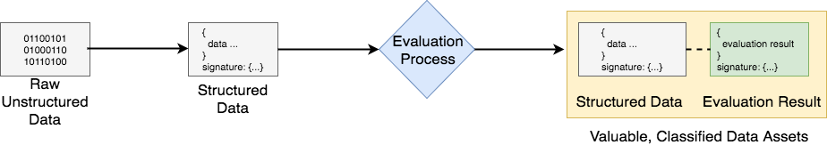
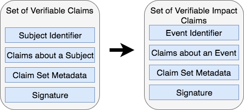
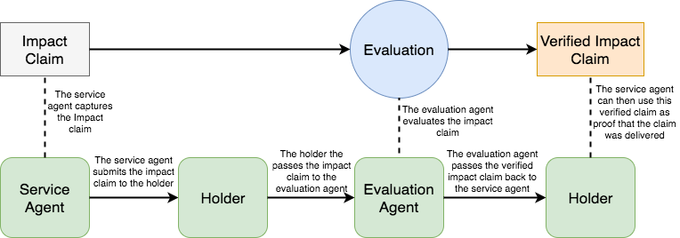

# Verifiable Claims of Impact #


Impact Claims are a new use-case for Verifiable Claims and the DID specification. We propose this could become a standard that will transform how information gets collected, evaluated, valued and exchanged to optimise sustainable development impacts.

The context for this is the UN’s 17 Global Goals to end poverty, protect the planet, and ensure prosperity for all, by 2030. To create a world that counts, the UN Secretary-General has called for a data revolution for sustainable development.
The prototype Impact Claims specification is a core part of the ixo Protocol that provides a decentralised mechanism to generate verified impact data as a fungible asset that can be traded for funding and other forms of value-exchange. This protocol increases the accountability and transparency of impact funding and service provision, whilst also generating a dynamic data commons for sustainable development. See the ixo White Paper for more information.



The ixo protocol follows the archetypical process for transforming raw data into valuable, classified data assets, through an evaluation process, as depicted in the figure. It is interesting to think that this generic pattern applies to virtually any type of information. For instance, music files that are evaluated or curated by listeners applying star-ratings. The use-case we describe here could be extended to any evaluation process where the identities of service agents, evaluation agents, beneficiaries and purchasers is of some consequence. We are interested to explore the generalisability of this model, which could be thought of as Verifiable Claims about facts that are extrinsic to the identities of the subject/s or participants in an event or process. This contrasts with the established use of Verifiable Claims about facts that are intrinsic to the identity of the subject/s of the claim.

In the case of Impact Claims, data inputs are semantically structured using a data model that we have derived from the Verifiable Claims standard. Claims are evaluated through a decentralised impact exchange mechanism, using a system of Ethereum Blockchain smart contracts to coordinate and incentivise participants to process and verify the claims data in this way. The evaluation can be carried out by identified human evaluation agents (augmented with software tools), or entirely conducted by identified software oracles. As claims pass the evaluation requirements, this produces valuable Verified Impact Claims Data and the tokenized representation of the data, which gets recorded as transactions in a distributed public ledger.

We use the popular term ‘High-Definition’ to describe information outputs that are produced in this. This is higher-resolution because all data points resolve to unique identifiers (using the DID spec) and it is higher-fidelity because the data gets reliably structured (using semantically defined linked-data schemas), as well as cryptographically authenticated and secured.

A prototype data model for Impact Claims is described below. We are interested to review this as a canonical equivalent to or derivative of the Verifiable Claims data model. We are also keen to address a number of outstanding specification and technical implementation questions (outlined at the end of this paper) that have arisen through our initial phase of work.

***

# Impact Claim

### _Public Working Draft dated 21 September 2017_
**Editors**

Cedric Franz

Shaun Conway

## Introduction
Granting the proof that an impact has been deliver by a service agent is a key component of the ixo protocol.  It requires an evaluation process to ensure the service delivery took place.  In this process, the **service agent** submits a claim for evaluation and an **evaluation agent** either verifies or denies the **impact claim** based on the evaluation of the data contained within the claim and by using other external data.

For example, a service agent could submit an impact claim that they have vaccinated a particular person for malaria.  The claim would include the data, location barcode of the malaria vile, beneficiary information etc. This specification provides a standard way to express these claims on the Web in a way that is cryptographically secure, privacy respecting, and automatically verifiable.

### What is an Impact Claim
An Impact Claim is a Verifiable Claim stating that an **impact service** has been delivered by a **service agent**.  It draws from the work done by the [W3C Verifiable Claims Working Group](https://www.w3.org/TR/verifiable-claims-data-model/) and also follows the standards and structures of the [Linked Data Signatures 1.0 Draft](https://w3c-dvcg.github.io/ld-signatures/). It is useful to understand the basic terminology and structure of an impact claim.

A verifiable impact claim maps from a Verifiable claim as follows:



## Terminlology ##

**impact claim**
> A statement made by an entity about an event. A verifiable impact claim is a claim that is effectively tamper-proof and whose authorship can be cryptographically verified.

**entity**
> A thing with distinct and independent existence such as a person, organization, concept, or device that triggers and event and claims it happened

**holder**
> An entity that is in control of one or more verifiable impact claims. Typically a holder is also the issuer of the verifiable impact claims that they issued.

**issuer**
> An entity that creates a verifiable impact claim, associates it with a particular event, and transmits it to a holder.  Typically this is a **service agent**

**service agent**
> The service agent is an entity that provices an impact service.  The entity could be a person or a machine. *Examples: nurse administring a vaccinantion, fingerprint scanner recording attendance*

**evaluation agent**
> An entity that receives one or more verifiable impact claims for processing. They either verify or deny a verifiable impact claim. This could be a manual task performed by a person or a machine that can evaluate the claim.

### Impact claim processing ecosystem
This section outlines the set of roles and as part of the ecosystem where impact claims are processed. We distinguish the essential roles of the core actors and the relationships between them including the way these actors interact. The following roles are introduced in this specification:



### Requirements
The are a number of key requirements that the actors within the ecosystem must perform:

The **holder** must receive and store impact claims from the **service agent**

The **holder** mediates the transmission of the impact claims between the service agent and the evaluation agent

Impact claims must be associated with an impact **indicator** and not particular services

**Service agents** should be able to easily control and own their own identifiers

**Holders** must be able to freely choose and change the agents they employ to help them manage and share their impact claims.

### Data Model
Every Impact Claim must contain the following information

**claim data**
> A set of data elements captured by an entity. An impact claim is a claim that is effectively tamper-proof and whose authorship can be cryptographically verified. It must include the following properties and then any other impact specific properties.
- **templateID**: Contains an ID of the impact claim template
- **contractID**: The ID of the contract governing these claims
- **indicator**: To classify the metric that will be captured by this impact claim
- **claimDate**: The date and time the impact claim was made
- **impactDate**: The date and time the impact was delivered
- **location**: The location where the impact claim was delivered
- **serviceAgentID**: Is the DID of the service agent that delivered the service
- **serviceCenterID**: The DID of the center or organisation that the service agent belongs to
- **reason**: A text field descibing why this impact was delivered.  This is captured from the impact claim template
- **result**: The result of the outcome of the service delivery captured by the service agent
- **beneficiaries** *(optional)*: Is a list of DIDs for beneficiaries of this impact service
- **productsUsed** *(optional)*: Is an array of the product identifiers of any products used in the delivery of the impact service.  This could be a barcode or other number identifying the product

**metadata**
> A set of metadata that is included with the claim that captures information regarding how, what, where and when the claim event occurred

**signature**
> The claim is signed by the claim issuer using a cryptographic signature to ensure the authenticity of the authorship of the impact claim


### JSON-LD Syntax

This section defines how the data model described in Data Model Section is realized in JSON-LD. Although syntactic mappings are only provided for these three different languages, applications and services may also use any other data representation language (XML, for example) that can support the data model.

### Example: Verifiable Impact Claim ###
```json-ld
{
  "@context": [
    "http://schema.cnsnt.io/",
    "http://schema.org/",
    “http://ixo.foundation/schema”,
    "https://w3id.org/identity",
    "https://w3id.org/security/v1",
    "https://iris.thegiin.org/indicators",
  ],

  "type": "ImpactClaim",


  “templateID” : "0x4600a18666a9f08f2f99a79ce8734e5b6f353a91",
  "contractID" : "0xb4b59c3acfeb9afd9398c88b2f6f003cbf29b553"
  "indicator": {
    "type": "Indicator",
    "brand": "IRIS",
    "code": "PI9468"
  },
  "claimDate": "2016-02-08T16:02:20Z",
  "impactDate": "2016-02-08T16:02:20Z",
  "location": {
    "latitude": "12.01156874",
    "longitude": "-175.57177874"
  },
  "serviceAgentID": "did:sov:21tDAKCERh95uGgKbJNHYp",
  "serviceCenterID": {
    "branch": "Cape Town",
    "geo": {
      "location": {
        "latitude": "12.01156874",
        "longitude": "-175.57177874"
      },
    }
  },
  "productsUsed": [],
  “claimData”: "ixo:ImpactClaimData"
  "reason": "Water provided",
  "result": {
    "type": "Rating",
    "ratingValue": "79"
  },

  "signature": {
    "type": "RsaSignature2016",
    "created": "2016-02-08T16:02:20Z",
    "creator": "did:example:8uQhQMGzWxR8vw5P3UWH1j#key/1",
    "signatureValue": "IOmA4R7TfhkYTYW8...CBMq2/gi25s="
  }

}

```


### Schema ###
```json-ld
{
   "@context": {
     "type": "@type",

     "cn":  "http://schema.cnsnt.io/",
     "so":  "http://schema.org/",
     "ixo": “http://ixo.foundation/schema”,
     "id":  "https://w3id.org/identity",
     "sec": "https://w3id.org/security/v1",
     "ind": "https://iris.thegiin.org/indicators",

     “templateID” : "ixo:TemplateRef"
     “contractID” : "ixo:ContractRef"
     "indicator": ixo:ImpactIndicator"
     "claimDate": "so:Date",
     "impactDate": "so:Date",
     "location": "so:GeoCoordinates"
     "serviceAgentID": "ixo:ServiceAgent",
     "secondaryServiceAgents": "ixo:ServiceAgents"
     "serviceCenterID": "so:Place",
     "beneficiaries": "so:People",
     "productsUsed": "so:ItemList"
     “claimData”: "ixo:ImpactClaimData"
     "reason": "ixo:ImpactReason",
     "result": "ixo:ImpactResult",

     "signatureChain": "sec:SignatureChain"
}

```

## References ##
[Verifiable Claims Working Group](https://www.w3.org/TR/verifiable-claims-data-model/)

[Linked Data Signatures 1.0 Draft](https://w3c-dvcg.github.io/ld-signatures/)

***

## Collaboration ##

We would like to invite collaborators to help further develop this specification and to consider if this use-case could feed into the W3C Verifiable Claims standardisation process.

### Questions ###

- Is a Verifiable Impact Claim a subtype of a Verifiable Claim or should the Verifiable Claim be extended to include claims about events as well as subjects?
- In some cases, an Impact Claim could contain "sub claims" (i.e. the device used might make a claim on location where the claim was made). How should this be handled?
- We will be capturing beneficiary information with minimal data.  Should we create DID's for the beneficiary and act as their guardian? How can we merge multiple DIDs for the same beneficiary?

