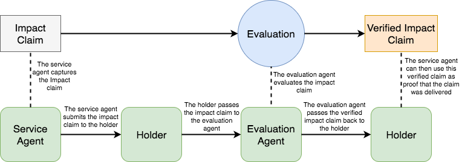

# Impact Claim

***

### _Public Working Draft dated 21 September 2017_
**Editors**

Cedric Franz

Shaun Conway

## Introduction
Granting the proof that an impact has been deliver by a service agent is a key component of the ixo protocol.  It requires a formal verification process to ensure the delivery took place.  In this process, the **service agent** submits a claim for verification and an **evaluation agent** either verifies or denies the **impact claim** based on the evaluation of the data contained within the claim and by using other external data.

For example, a service agent could submit an impact claim that they have vaccinated a particular person for malaria.  The claim would include the data, location barcode of the malaria vile, beneficiary information etc. This specification provides a standard way to express these claims on the Web in a way that is cryptographically secure, privacy respecting, and automatically verifiable.

### What is an Impact Claim
An Impact Claim is a Verifiable Claim stating that an **impact service** has been delivered by a **service agent**.  If follows the structure and standards setup by the [W3C Verifiable Claims Working Group](https://www.w3.org/TR/verifiable-claims-data-model/) and also follows the standards and structures of the [Linked Data Signatures 1.0 Draft](https://w3c-dvcg.github.io/ld-signatures/). It is useful to understand the basic terminology and structure of an impact claim.

An impact claim is made up of the following key elements:


**entity**
> A thing with distinct and independent existence such as a person, organization, concept, or device.

**claim data**
> A set of data elements captured by an entity. An impact claim is a claim that is effectively tamper-proof and whose authorship can be cryptographically verified.

**metadata**
> A set of metadata that is included with the claim that captures information regarding how, what and where the claim was captured

**signature**
> The claim is signed by the entity using a cryptographic signature to ensure the authenticity of the authorship of the impact claim

### Impact claim processing ecosystem
This section outlines the set of roles and as part of the ecosystem where impact claims are processed. We distinguish the essential roles of the core actors and the relationships between them including the way these actors interact. The following roles are introduced in this specification:

**service agent**
> The service agent is an entity that provices an impact service.  The entity could be a person or a machine. *Examples: nurse administring a vaccinantion, fingerprint scanner recording attendance*

**holder**
> The holder is an entitiy that stores and manages the impact claim and the associated data.

**evaluation agent**
> Evaluation agent is an entity that either verifies or denies an impact claim that was made by service agent.  This could be a manual task performed by a person or a machine that can evaluate the claim.



### Requirements
The are a number of key requirements that the actors within the ecosystem must perform:

The **holder** must receive and store impact claims from the service agent

The **holder** mediates the transmission of the impact claims between the service agent and the evaluation agent

Impact claims must be associated with an impact **indicators** and not particular services

**Service agents** should be able to easily control and own their own identifiers

**Holders** must be able to freely choose and change the agents they employ to help them manage and share their impact claims.

### Data Model
Every Impact Claim must contain the following information

- **templateID**: Contains an IPLD reference to the impact claim template
- **indicator**: To classify the metric that will be captured by this impact claim
- **claimDate**: The date and time the impact claim was made
- **impactDate**: The date and time the impact was delivered
- **location**: The location where the impact claim was delivered
- **serviceAgentID**: Is the DID of the service agent that delivered the service
- **serviceCenterID**: The DID of the center or organisation that the service agent belongs to
- **beneficiaries** *(optional)*: Is a list of DIDs for beneficiaries of this impact service
- **productsUsed** *(optional)*: Is an array of the product identifiers of any products used in the delivery of the impact service.  This could be a barcode or other number identifying the product
- **claimData**: The list of claim specific keys and values that are captured for this claim bassed off the impact claim template
- **reason**: A text field descibing why this impact was delivered.  This is captured from the impact claim template
- **result**: One of the following results captured by the service agent
  - VERY_EFFECTIVE
  - EFFECTIVE
  - NEUTRL
  - INEFFECTIVE
  - VERY_INEFFECTIVE 
- **signatureChain**: Is a list of signatures of the entities who signed the claim.  The service agent must sign it, but other entities such as the beneficiaries might also sign the claim


### JSON-LD Syntax

This section defines how the data model described in Data Model Section is realized in JSON-LD. Although syntactic mappings are only provided for these three different languages, applications and services may also use any other data representation language (XML, for example) that can support the data model.

```json-ld
{
   "@context": {
     "id": "@id",
     "type": "@type",

     "cn":  "http://schema.cnsnt.io/",
     "so":  "http://schema.org/",
     "ixo": “http://ixo.foundation/schema”,
     "id":  "https://w3id.org/identity",
     "sec": "https://w3id.org/security/v1",
     "ind": "https://iris.thegiin.org/indicators",

     “templateID” : "ixo:TemplateRef"
     "indicator": ixo:Impactndicator"
     "claimDate": "so:Date",
     "impactDate": "so:Date",
     "location": "so:GeoCoordinates"
     "serviceAgentID": "ixo:ServiceAgent",
     "secondaryServiceAgents": "ixo:ServiceAgents"
     "serviceCenterID": "so:Place",
     "beneficiaries": "so:People",
     "productsUsed": "so:ItemList"
     “claimData”: "ixo:ImpactClaimData"
     "reason": "ixo:ImpactReason",
     "result": "ixo:ImpactResult",

     "signatureChain": "sec:SignatureChain"
}

```
